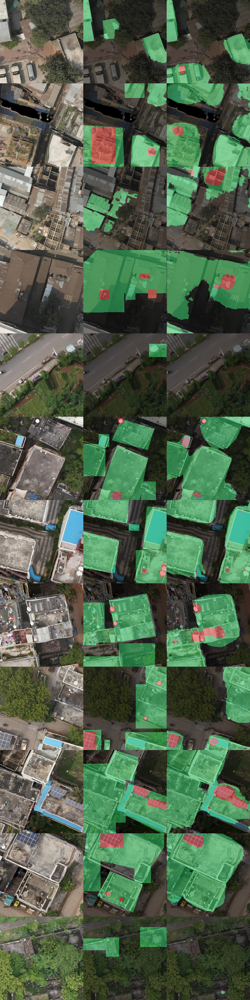
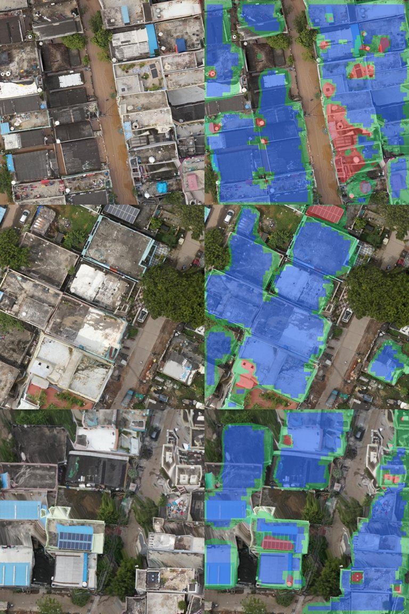

# SolarScope

**How much of a cluttered Indian rooftop can really carry solar panels?**

Indian flat roofs are full of water tanks, stairwell rooms, AC units and dishes. SolarScope takes a top-down
drone or aerial image, segments **usable roof** vs **obstructions**, lets the user fix the mask with a brush,
applies an edge setback and obstruction buffer, packs real panel rectangles into what is left, and reports
capacity (kWp), yearly generation (kWh), savings (₹), payback after subsidy and CO₂ avoided, with every
assumption and its source shown.

Built for Environmental Hacks (WeMakeDevs x AWS), track: Waste and Energy (Rooftop solar).

## How it works

1. **Segmentation**: U-Net (ResNet-34 encoder, segmentation-models-pytorch) trained on hand-labelled 0.1 m/px
   tiles of Vijayawada (India) and Dhaka drone imagery from OpenAerialMap (CC-BY 4.0). Exported to ONNX, runs on CPU.
2. **Scale**: metres per pixel from the image's stated resolution, or by drawing a line over a known length.
3. **Correction**: brush to paint roof / obstruction / erase; click "Pick my roof" to analyse one building.
4. **Geometry** (`backend/geometry.py`): edge setback and obstruction buffer by Euclidean distance transform;
   greedy panel packing in both orientations and several row offsets, keeping the best.
5. **Economics** (`backend/solar_calc.py`): irradiance from NASA POWER for the site → yield → savings,
   tiered PM Surya Ghar style subsidy with cap → payback → CO₂.

## Where AWS fits

| AWS service | What runs there |
|---|---|
| **EC2** (t3.small, Ubuntu 24.04, ap-south-1) | The whole app: FastAPI + ONNX Runtime + static frontend, as a systemd service |
| **S3** | Model weights (`models/solarscope.onnx`), pulled at deploy time |
| **IAM role** (instance profile) | Read-only access from EC2 to the weights bucket; no access keys on the server |

Deploy guide: [`infra/DEPLOY.md`](infra/DEPLOY.md).

## Model results

U-Net (ResNet-34, ImageNet encoder) trained for 40 epochs (10 min on a laptop CPU) on 65 hand-labelled
256 px tiles (273 roof and 89 obstruction polygons, 11 background-only tiles); evaluated on 13 held-out tiles.

| Class | IoU (held-out) |
|---|---|
| Background | 0.71 |
| Roof | 0.58 |
| Obstruction | 0.24 |
| **Mean** | **0.51** |



*Columns: image, hand label, prediction (green roof, red obstruction). Split in `docs/split.json`.*

**Reading the numbers honestly:**
- Roof IoU is pulled down partly by our own labels: several validation tiles have real roofs we did not
  label, which the model does find (rows 2, 3, 6, 8 above) and which count as errors.
- Obstruction IoU is low. The model finds large water tanks, stair rooms and existing solar arrays,
  but misses small white tanks and AC units (~6-9 px at 0.1 m/px). That is why the app has a correction brush.
- Small data: 78 tiles from two cities. Touching roofs of neighbouring buildings merge into one region.



## Ground-truth check

_TBD: tape-measured roof vs SolarScope estimate._

## Run locally (Windows PowerShell)

```powershell
python -m venv .venv
.\.venv\Scripts\Activate.ps1
pip install -r requirements-dev.txt
pytest -q
uvicorn backend.app:app --reload --port 8000     # open http://localhost:8000
```

Put a trained `solarscope.onnx` (+ `.json`) in `models/` to enable detection; without it you can paint the roof by hand.

## Train the model

1. Label `training/tiles/*.png` in Roboflow (classes `roof`, `obstruction`; roof first, obstructions on top), export **COCO Segmentation** without augmentations.
2. `python training/coco_to_masks.py --coco <unzipped export> --preview` → `training/labels/` (check `training/labels_preview/`), commit and push.
3. Open `training/train_colab.ipynb` in Colab (T4 GPU), run all, download `solarscope.onnx` and `solarscope.json`.

## Assumptions to verify

All economic inputs live in `backend/solar_calc.py` (`DEFAULT_ASSUMPTIONS`). Each is shown in the report with its
source and a verified flag. **Values marked unverified are placeholders.**

| Key | Placeholder | Source to check |
|---|---|---|
| `ghi_kwh_m2_day` | 5.0 kWh/m²/day (fallback only) | NASA POWER per site (used automatically when lat/lon given) |
| `performance_ratio` | 0.75 | Cite a published PR reference |
| `tariff_inr_per_kwh` | 7.0 | State DISCOM residential tariff order |
| `installed_cost_inr_per_kw` | 60,000 | MNRE / PM Surya Ghar benchmark cost |
| `subsidy_tier1_*`, `subsidy_tier2_*`, `subsidy_cap_inr` | 30,000/kW × 2 kW, 18,000/kW × 1 kW, cap 78,000 | pmsuryaghar.gov.in (current guidelines) |
| `grid_emission_kg_per_kwh` | 0.71 | CEA CO₂ Baseline Database (latest version) |
| Panel 2.0 × 1.1 m, 550 Wp | layout default | A real module datasheet |

Simplifications: flush/low-tilt mounting (no inter-row shading spacing), no degradation or tariff escalation,
simple payback.

## AI tools used

Claude (Claude Code) was used as a pair programmer for code, tests and docs.

## License

MIT, see `LICENSE`. Third-party data, weights and libraries in [`CREDITS.md`](CREDITS.md).
